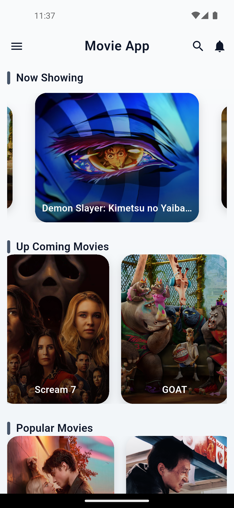
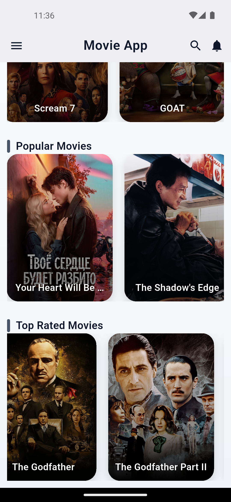

# 🎬 Flutter Movie App

A **modern Flutter application** built for practicing **API integration**, showcasing real-time movie data using the TMDB API with a clean and responsive UI.

---

## 🚀 Features

* 🎞️ Now Playing Movies (Carousel Slider)
* 🔜 Upcoming Movies
* 🔥 Popular Movies
* ⭐ Top Rated Movies
* 🌐 Live API Integration (TMDB)
* 🎨 Clean UI with gradient design
* ⚡ Smooth scrolling experience

---

## 📸 Screenshots

<table align="center">
  <tr>
    <td></td>
    <td width="40"></td>
    <td></td>
  </tr>
</table>

---

## 🛠️ Tech Stack

* **Flutter**
* **Dart**
* **REST API (TMDB)**
* **HTTP Package**
* **Carousel Slider**

---

## 📂 Project Structure

```
lib/
│
├── Model/
│   └── model.dart
│
├── Screen/
│   └── home_screen.dart
│
├── Services/
│   └── services.dart
│
└── main.dart
```

---

## 🔑 API Configuration

This project uses **TMDB API**.

To run this project,  add Your own API key:

```
TMDB_API_KEY=your_api_key_here
```

> ⚠️ The API key is not included in this repository for security reasons.

---

## ⚙️ Getting Started

### 1. Clone the repo

```
git clone https://github.com/silentboy-07/Flutter-Movie-App.git
```

### 2. Go to project folder

```
cd Flutter-Movie-App
```

### 3. Install dependencies

```
flutter pub get
```

### 4. Add your API key in `.env`

### 5. Run the app

```
flutter run
```

---

## 💡 Future Improvements

* 🔍 Search functionality
* 🎬 Movie details screen
* ❤️ Favorites feature
* 🌙 Dark mode
* ⚡ State management (GetX / Provider)

---

## 🙌 Author

**Vikas Singh**

---

⭐ If you like this project, give it a star!
